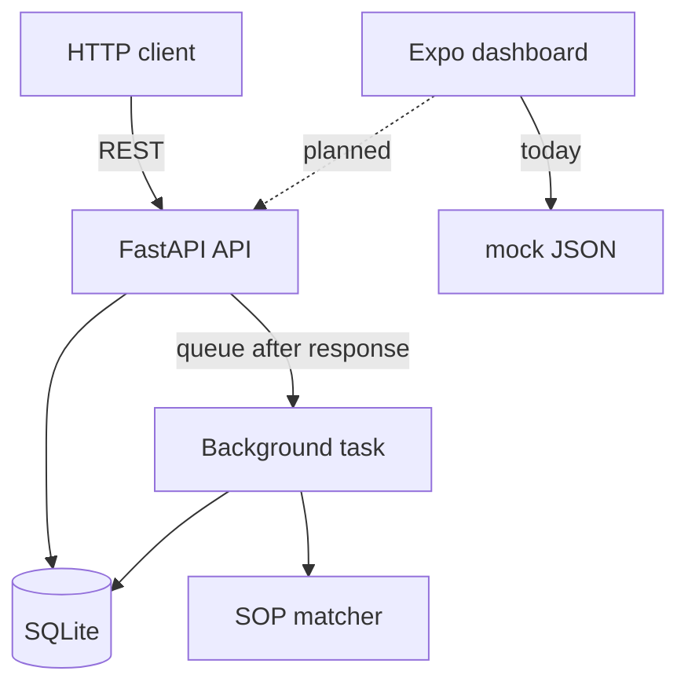
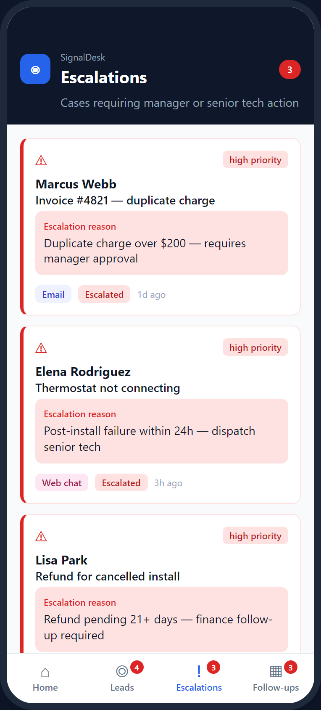
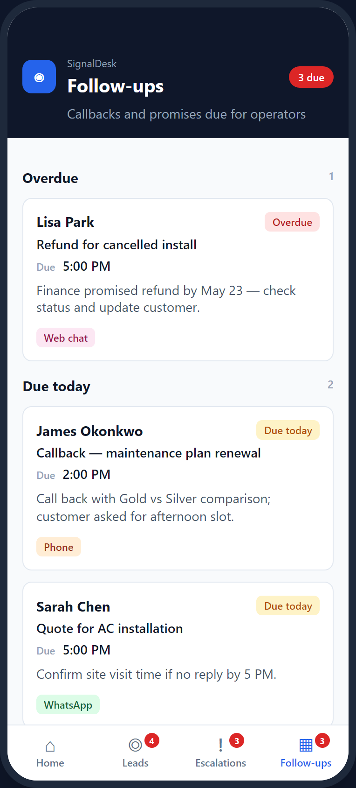
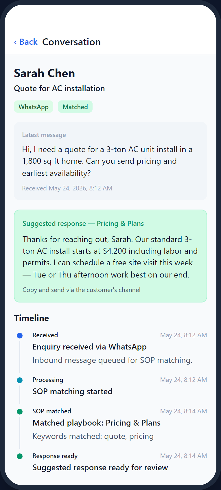

# SignalDesk

Internal MVP for triaging inbound enquiries: **FastAPI workflow API** + **Expo ops dashboard**. Keyword SOP playbooks (no AI), append-only timeline per thread, mobile views for leads, escalations, and follow-ups.

The API owns state. The app still uses **mock data**; types and fields match the shared contract, so connecting the client is mostly a data-layer swap—not a UI rewrite.

---

## What's in the repo

| Path | Role |
|------|------|
| [`backend/`](backend/) | Enquiry API — create, follow-up, escalate, history; background SOP matching |
| [`frontend/`](frontend/) | Expo (React Native) ops app — Home, Leads, Escalations, Follow-ups, conversation detail |
| [`docs/product-contract.md`](docs/product-contract.md) | Shared domain model (statuses, channels, events, field names) |
| [`docs/api/`](docs/api/README.md) | REST examples, status codes, errors |
| [`docs/screenshots/`](docs/screenshots/README.md) | Dashboard UI captures |
| [`docs/walkthrough/`](docs/walkthrough/README.md) | End-to-end demo video guide |

Per-track setup: [backend/README.md](backend/README.md) · [frontend/README.md](frontend/README.md) · Commits: [CONTRIBUTING.md](CONTRIBUTING.md) · [development workflow](docs/development-workflow.md)

---

## Quick start

**Backend** (from repo root):

```bash
cd backend
python -m venv .venv
.venv\Scripts\activate          # macOS/Linux: source .venv/bin/activate
pip install -r requirements.txt
uvicorn app.main:app --reload --port 8000
```

→ http://127.0.0.1:8000/docs · tests: `pytest -q` · optional env: [backend/.env.example](backend/.env.example)

**Frontend**:

```bash
cd frontend
npm install
npm start
```

Use Expo Go or a simulator (`i` / `a`). Node **20 or 22** recommended (see [frontend/README.md](frontend/README.md) for version notes). Typecheck: `npm run typecheck`.

The app does not hit the API yet—run backend and mobile side by side when you want to show both halves.

---

## How it fits together



Solid lines match the current repo: the API persists enquiries, returns immediately, and runs SOP matching in a FastAPI `BackgroundTasks` job (`EnquiryService` + keyword matcher → SQLite). The dashboard reads `frontend/mock/`; it does not call the API yet.

**Request path (today):** `POST /enquiry` saves the thread and queues in-process SOP matching. The handler returns right away with `processing: true`. Background work moves `received` → `processing` → `matched` or `escalated` and appends timeline events. Follow-ups clear match fields and run the same pipeline again.

**Client path (today):** screens read mock JSON shaped like the contract (`snake_case` on the wire, `camelCase` in TypeScript). Home KPIs are computed in-app; list and detail screens match the views we expect from the API later.

| Concern | Backend | Frontend |
|---------|---------|----------|
| Entry | `app/main.py` | `App.tsx` → navigators |
| HTTP / navigation | `routers/` | `screens/` |
| Domain logic | `services/` + `sops.py` | `src/data/mockData.ts` |
| Persistence | SQLAlchemy + `repositories/` | `mock/*.json` |
| Contract | `docs/product-contract.md` | `src/types/` |

JSON logs cover HTTP, enquiry lifecycle, and background tasks. OpenAPI at `/docs` has request/response models and examples.

---

## Screenshots

Dashboard captures (Northline HVAC demo data). Gallery and captions: **[docs/screenshots/](docs/screenshots/README.md)**.

| Screen | Preview | Notes |
|--------|---------|--------|
| Home |  | KPIs, priority queue, recent activity — [caption](docs/screenshots/home.md) |
| Leads |  | Inbound threads by channel/status — [caption](docs/screenshots/leads.md) |
| Escalations |  | Reasons and priority — [caption](docs/screenshots/escalations.md) |
| Follow-ups |  | Overdue / today / upcoming — [caption](docs/screenshots/follow-ups.md) |
| Conversation |  | Message, suggested SOP reply, timeline — [caption](docs/screenshots/conversation-detail.md) |

Regenerate PNGs after UI token changes: see the [_render/](docs/screenshots/_render/) Playwright scripts in the screenshots doc.

---

## Engineering decisions

**BackgroundTasks (not Celery/Redis)** — Matching is in-process substring search over five playbooks. `BackgroundTasks` lets the handler return while work runs after the response; each task opens its own DB session. Enough for a single-worker prototype. If matching later hits slow external APIs, the same service methods can sit behind a queue without changing route shapes.

**SQLite by default** — Clone and run with no extra services (`sqlite:///./signaldesk.db`). Same SQLAlchemy models work against PostgreSQL via `DATABASE_URL`. Schema via `create_all` (no Alembic in this MVP). Move to Postgres when you need multiple API workers.

**Mock-first frontend** — Built screens and navigation on realistic ops data while the API was still moving. Mocks and API types share one contract; hooking the app up is mostly mapping at the data layer. Downside: no live loading states, auth, or write-through from the app yet—we prioritized layout and triage flows first.

Route handlers and ORM calls are **sync** (FastAPI thread pool); only framework hooks use `async`. UI uses theme tokens and `StyleSheet`—no CSS-in-JS layer.

---

## API at a glance

Base URL: `http://127.0.0.1:8000`. Full reference: [docs/api/README.md](docs/api/README.md) · REST Client: [backend/signaldesk.http](backend/signaldesk.http).

| Method | Path | Purpose |
|--------|------|---------|
| `GET` | `/health` | Liveness + DB connectivity |
| `POST` | `/enquiry` | Create enquiry; queue SOP matching (`201`, `processing: true`) |
| `GET` | `/enquiry/{id}/history` | Snapshot + timeline (oldest first) |
| `POST` | `/enquiry/{id}/follow-up` | Append message; re-queue matching |
| `POST` | `/enquiry/{id}/escalate` | Manual escalation with reason |

Errors are always `{ "detail": "string" }` (`404`, `409`, `422`).

**Example — create and poll:**

```http
POST /enquiry
Content-Type: application/json

{
  "customer_name": "Sarah Chen",
  "channel": "whatsapp",
  "subject": "Quote for AC installation",
  "message": "Need a quote for pricing and install on a 3-ton unit."
}
```

Poll `GET /enquiry/{id}/history` until `status` is `matched` (SOP hit) or `escalated` (no keyword match). Messages without playbook keywords auto-escalate.

---

## SOP playbooks

Five hardcoded playbooks in `backend/app/sops.py`. First case-insensitive substring match on the enquiry message wins.

| ID | Title |
|----|--------|
| `sop-pricing` | Pricing & Plans |
| `sop-refund` | Refund & Cancellation |
| `sop-technical` | Technical Support |
| `sop-billing` | Billing & Invoices |
| `sop-hours` | Business Hours & Availability |

---

## Future extensions

If this grows past a prototype (nothing here is required to run or review the repo today):

- Wire Expo to the API (lists/history; optional follow-up/escalate from the app).
- PostgreSQL + Alembic for multi-worker or multi-env deploys.
- `closed` status endpoint and operator archive flow.
- Outbound send (email/WhatsApp) on the same timeline model.
- Auth and tenant scoping for a multi-user ops team.

---

## Scope (today)

| Area | Today |
|------|--------|
| Auth | None (internal tool) |
| AI / LLM | None — keywords only |
| Frontend ↔ API | Not wired; mocks match contract |
| `closed` status | In model; no close route yet |
| Migrations | `create_all` only |
| CRM / payments / multi-tenant | Not in scope |

**Naming:** API/Python/DB use `snake_case`; TypeScript mocks use `camelCase`; SOP ids use `sop-*`. Details: [docs/product-contract.md](docs/product-contract.md).

---

## License

MIT — see [LICENSE](LICENSE).
