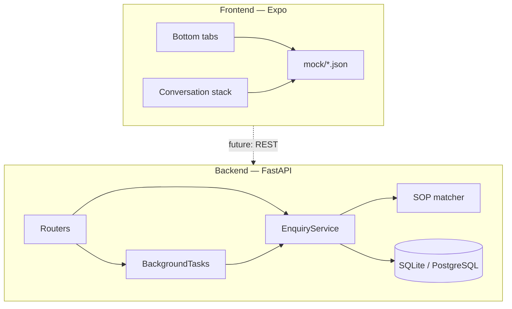

# SignalDesk

SignalDesk helps a small business triage inbound customer enquiries: accept messages, match them to keyword-based SOP playbooks (no AI), record an operational timeline, and surface leads, escalations, and follow-ups in a mobile operations dashboard.

This repository is a **single monorepo** with separate **`/backend`** and **`/frontend`** folders, one combined README (this file), and a walkthrough video referenced below — matching the bonus submission format.

---

## Repository layout

```
SignalDesk/
├── backend/          # FastAPI API — enquiry workflow, SOP matching, history
├── frontend/         # Expo (React Native) ops dashboard — mock data for now
├── docs/
│   ├── product-contract.md   # Shared domain model (read before changing types)
│   ├── api/                  # REST examples and error reference
│   ├── screenshots/          # UI captures (see docs/screenshots/README.md)
│   └── walkthrough/          # Demo video guide (see docs/walkthrough/README.md)
├── LICENSE
└── README.md         # This file
```

Track-specific quick notes: [backend/README.md](backend/README.md) · [frontend/README.md](frontend/README.md)

---

## Walkthrough video

Record a single end-to-end demo and place it at **`docs/walkthrough/walkthrough.mp4`**. Full recording guide: [docs/walkthrough/README.md](docs/walkthrough/README.md).

Suggested flow (3–5 minutes): start the API → create and poll enquiries → show auto-escalation → walk the mobile app (Home → Leads → Escalations → Follow-ups → Conversation detail).

---

## Screenshots

UI captures for every dashboard screen live under [`docs/screenshots/`](docs/screenshots/README.md).

| Screen | Image | Caption |
|--------|-------|---------|
| Home dashboard | [home.png](docs/screenshots/home.png) | [home.md](docs/screenshots/home.md) |
| Leads | [leads.png](docs/screenshots/leads.png) | [leads.md](docs/screenshots/leads.md) |
| Escalations | [escalations.png](docs/screenshots/escalations.png) | [escalations.md](docs/screenshots/escalations.md) |
| Follow-ups | [follow-ups.png](docs/screenshots/follow-ups.png) | [follow-ups.md](docs/screenshots/follow-ups.md) |
| Conversation detail | [conversation-detail.png](docs/screenshots/conversation-detail.png) | [conversation-detail.md](docs/screenshots/conversation-detail.md) |

Optional: short clips per tab in `docs/screenshots/` if your submission allows multiple media files.

---

## Quick start

### Backend (API)

```bash
cd backend
python -m venv .venv
# Windows
.venv\Scripts\activate
# macOS/Linux
source .venv/bin/activate

pip install -r requirements.txt
uvicorn app.main:app --reload --port 8000
```

- API: http://127.0.0.1:8000  
- OpenAPI: http://127.0.0.1:8000/docs  
- Tests: `pytest -q`  
- Optional env: copy [backend/.env.example](backend/.env.example) to `backend/.env`

### Frontend (mobile)

```bash
cd frontend
npm install
npm start
```

Use Expo Go or a simulator (`i` / `a` in the terminal). Typecheck: `npm run typecheck`.

The frontend uses **mock JSON only** today; it does not call the API yet. Shapes align with the contract so integration is a wiring step, not a redesign.

---

## Architecture



| Layer | Backend | Frontend |
|-------|---------|----------|
| Entry | `app/main.py` | `App.tsx` → `RootNavigator` |
| HTTP / navigation | `routers/` | `screens/` + React Navigation |
| Domain logic | `services/` | `data/mockData.ts` (→ API client later) |
| Persistence | `repositories/` + SQLAlchemy | `mock/*.json` |
| Shared contract | `docs/product-contract.md` | `src/types/` + mock field names |

---

## Design decisions & trade-offs

### Backend: async processing with `BackgroundTasks`

**Choice:** After `POST /enquiry` or follow-up, SOP keyword matching runs in FastAPI **`BackgroundTasks`**, not Celery.

**Rationale:** Matching is fast, in-process substring search over five playbooks. The API can return immediately with `processing: true` while work finishes after the response. Each task opens its **own database session** so request and worker lifecycles stay isolated.

**Trade-off:** No distributed queue, retries, or dead-letter handling. If matching later calls slow external APIs, move the same service methods behind Celery/Redis without changing the HTTP contract.

**Note:** Route handlers and SQLAlchemy access are **synchronous**; FastAPI runs them in a thread pool. Only lifespan/validation handlers use `async def` — appropriate for this workload.

### Backend: SQLite default, PostgreSQL-ready

**Choice:** Default `DATABASE_URL` is `sqlite:///./signaldesk.db`.

**Rationale:** Zero infrastructure for reviewers — clone, `pip install`, run. SQLAlchemy models and repositories work unchanged with PostgreSQL via `DATABASE_URL=postgresql+psycopg://...`.

**Trade-off:** SQLite suits a single worker and demo load. Production multi-worker deployments should use PostgreSQL (driver not pinned in `requirements.txt`; add `psycopg` when needed). Schema is created with `create_all` — no Alembic migrations in scope.

### Frontend: theme tokens + `StyleSheet`

**Choice:** Centralized tokens in `src/theme/` (`colors`, `spacing`, `typography`) and per-component `StyleSheet` — no CSS-in-JS library, no NativeWind.

**Rationale:** Keeps dependencies free and minimal, matches React Native defaults, and enforces consistent channel/status colors across cards and badges. Easy for reviewers to scan without learning a styling DSL.

**Trade-off:** More verbose than utility-class frameworks; acceptable for a focused ops UI.

### Frontend: mock-first

**Choice:** All screens read from `frontend/mock/` via `mockData.ts` using **camelCase**; API uses **snake_case** per contract.

**Rationale:** UI and API can be built and graded independently. Integration is mapping at the data layer, not rebuilding screens.

**Trade-off:** KPIs on Home are derived from mock data in code; activity/priority queue remain curated JSON. No loading, auth, or write actions in the app.

---

## API usage examples

Base URL: `http://127.0.0.1:8000`. Full reference (requests, responses, status codes, errors): [docs/api/README.md](docs/api/README.md). REST Client file: [backend/signaldesk.http](backend/signaldesk.http).

### Health

```http
GET /health
```

```json
{
  "status": "ok",
  "service": "SignalDesk API",
  "database": "connected"
}
```

### Create enquiry (expect SOP match)

```http
POST /enquiry
Content-Type: application/json

{
  "customer_name": "Sarah Chen",
  "channel": "whatsapp",
  "subject": "Quote for AC installation",
  "message": "Need a quote for pricing and install on a 3-ton unit."
}
```

**Response `201`:**

```json
{
  "enquiry": {
    "id": "550e8400-e29b-41d4-a716-446655440000",
    "customer_name": "Sarah Chen",
    "channel": "whatsapp",
    "subject": "Quote for AC installation",
    "message": "Need a quote for pricing and install on a 3-ton unit.",
    "status": "received",
    "matched_sop_id": null,
    "matched_sop_title": null,
    "suggested_response": null,
    "created_at": "2026-05-24T08:12:00Z",
    "updated_at": "2026-05-24T08:12:00Z"
  },
  "processing": true
}
```

Poll history until `status` is `matched` or `escalated`:

```http
GET /enquiry/{id}/history
```

### Create enquiry (no keywords → auto-escalate)

```json
{
  "customer_name": "Alex Kim",
  "channel": "email",
  "subject": "Hello",
  "message": "Just checking in — no specific topic."
}
```

### Follow-up

```http
POST /enquiry/{id}/follow-up
Content-Type: application/json

{ "message": "Also need help with a refund on invoice 9921." }
```

Re-queues background matching; returns `409` if enquiry is `closed` or still `processing`.

### Manual escalate

```http
POST /enquiry/{id}/escalate
Content-Type: application/json

{ "reason": "Duplicate charge requires manager approval" }
```

Returns `409` if already escalated or closed.

### Errors

All errors use `{ "detail": "string" }`. Validation failures return `422`.

---

## SOP playbooks (keyword matching)

Five hardcoded playbooks in `backend/app/sops.py`:

| ID | Title |
|----|--------|
| `sop-pricing` | Pricing & Plans |
| `sop-refund` | Refund & Cancellation |
| `sop-technical` | Technical Support |
| `sop-billing` | Billing & Invoices |
| `sop-hours` | Business Hours & Availability |

First case-insensitive substring match on the enquiry message wins. No match → `auto_escalated`.

---

## Known limitations (intentional scope)

| Area | Limitation |
|------|------------|
| Auth | None — internal tool assumption |
| AI / LLM | None — keyword SOP matching only |
| Frontend ↔ API | Not wired; mock data only |
| Enquiry `closed` | Status exists; no public close endpoint yet |
| Migrations | `create_all` only; no Alembic |
| Payments / CRM | Out of scope |
| Multi-tenant | Out of scope |
| Paid dependencies | None — OSS stack only |

---

## Naming consistency

| Layer | Convention | Example |
|-------|------------|---------|
| API / Python / DB | `snake_case` | `customer_name`, `matched_sop_id` |
| TypeScript / mocks | `camelCase` | `customerName`, `matchedSopId` |
| SOP ids | `sop-*` kebab | `sop-pricing` |
| Routes | lowercase paths | `/enquiry/{id}/follow-up` |
| React Navigation | PascalCase screens | `ConversationDetail` |

See [docs/product-contract.md](docs/product-contract.md) for statuses, channels, and event types.

---

## Assignment alignment

| Requirement | Location |
|-------------|----------|
| Backend API (enquiry workflow, SOP, history) | `backend/` |
| React Native / Expo dashboard | `frontend/` |
| Bottom tabs: Home, Leads, Escalations, Follow-ups | `frontend/src/navigation/` |
| Conversation detail stack screen | `ConversationDetail` |
| Mock data in `/mock` | `frontend/mock/` |
| Reusable UI components | `frontend/src/components/` |
| No auth / no paid deps | Enforced |
| Bonus: single repo, `/backend` + `/frontend`, combined README, walkthrough | This repo |

---

## License

MIT — see [LICENSE](LICENSE).
