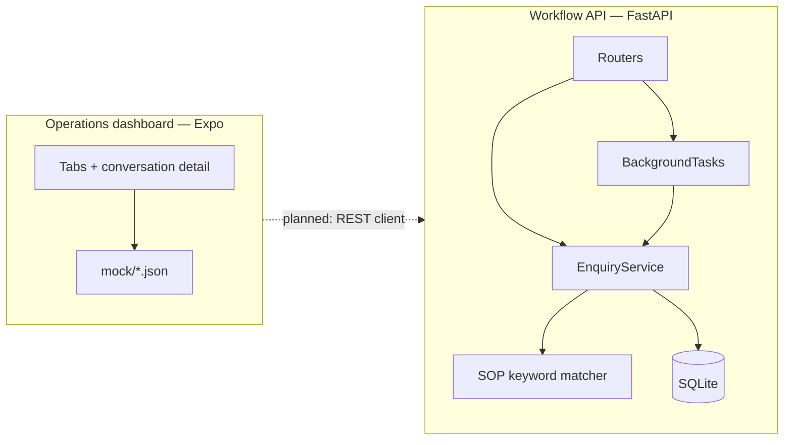

# SignalDesk

Internal MVP for triaging inbound customer enquiries: a **FastAPI workflow API** plus an **Expo operations dashboard**. Messages are matched to keyword-based SOP playbooks (no AI), each enquiry gets an append-only operational timeline, and the mobile UI surfaces leads, escalations, and follow-ups.

The API is the source of truth. The dashboard runs on **mock data** today; shapes follow a shared contract so wiring the client is a data-layer change, not a redesign.

---

## What's in the repo

| Path | Role |
|------|------|
| [`backend/`](backend/) | Enquiry API — create, follow-up, escalate, history; background SOP matching |
| [`frontend/`](frontend/) | Expo (React Native) ops app — Home, Leads, Escalations, Follow-ups, conversation detail |
| [`docs/product-contract.md`](docs/product-contract.md) | Shared domain model (statuses, channels, events, field names) |
| [`docs/api/`](docs/api/README.md) | REST examples, status codes, errors |
| [`docs/screenshots/`](docs/screenshots/README.md) | Dashboard UI captures |
| [`docs/walkthrough/`](docs/walkthrough/README.md) | End-to-end demo video guide |

Track quick starts: [backend/README.md](backend/README.md) · [frontend/README.md](frontend/README.md) · Commit conventions: [CONTRIBUTING.md](CONTRIBUTING.md)

---

## Quick start

**Backend** (from repo root):

```bash
cd backend
python -m venv .venv
.venv\Scripts\activate          # macOS/Linux: source .venv/bin/activate
pip install -r requirements.txt
uvicorn app.main:app --reload --port 8000
```

→ http://127.0.0.1:8000/docs · tests: `pytest -q` · optional env: [backend/.env.example](backend/.env.example)

**Frontend**:

```bash
cd frontend
npm install
npm start
```

Use Expo Go or a simulator (`i` / `a`). Node **20 or 22** recommended (see [frontend/README.md](frontend/README.md) for version notes). Typecheck: `npm run typecheck`.

The app does not call the API yet; use the backend and mobile UI side by side when demoing the full product.

---

## How it fits together



**Request path (today):** `POST /enquiry` persists the thread and queues in-process SOP matching. The handler returns immediately with `processing: true`. A background task transitions `received` → `processing` → `matched` or `escalated`, writing timeline events along the way. Follow-ups reset match fields and re-queue the same pipeline.

**Client path (today):** screens load curated mock JSON aligned to the contract (`snake_case` in API, `camelCase` in TypeScript). Home KPIs are derived in code; lists and detail mirror the operational views the API will feed later.

| Concern | Backend | Frontend |
|---------|---------|----------|
| Entry | `app/main.py` | `App.tsx` → navigators |
| HTTP / navigation | `routers/` | `screens/` |
| Domain logic | `services/` + `sops.py` | `src/data/mockData.ts` |
| Persistence | SQLAlchemy + `repositories/` | `mock/*.json` |
| Contract | `docs/product-contract.md` | `src/types/` |

Structured JSON logs cover HTTP requests, enquiry lifecycle, and background tasks. OpenAPI at `/docs` documents request/response models with examples.

---

## Screenshots

Static captures of the dashboard (Northline HVAC demo data). Full gallery with captions: **[docs/screenshots/](docs/screenshots/README.md)**.

| Screen | Preview | Notes |
|--------|---------|--------|
| Home |  | KPIs, priority queue, recent activity — [caption](docs/screenshots/home.md) |
| Leads |  | Inbound threads by channel/status — [caption](docs/screenshots/leads.md) |
| Escalations |  | Reasons and priority — [caption](docs/screenshots/escalations.md) |
| Follow-ups |  | Overdue / today / upcoming — [caption](docs/screenshots/follow-ups.md) |
| Conversation |  | Message, suggested SOP reply, timeline — [caption](docs/screenshots/conversation-detail.md) |

Regenerate PNGs after UI token changes: see the [_render/](docs/screenshots/_render/) Playwright scripts in the screenshots doc.

---

## Walkthrough video

Record a single end-to-end demo at **`docs/walkthrough/walkthrough.mp4`**. Suggested flow (~3–5 min): start API → create enquiries (match + auto-escalate) → poll history → open the mobile app across all tabs. Guide: [docs/walkthrough/README.md](docs/walkthrough/README.md).

---

## Engineering decisions

**BackgroundTasks (not Celery/Redis)** — SOP matching is fast in-process substring search over five playbooks. `BackgroundTasks` returns the HTTP response immediately while matching runs after the response; each task uses its own DB session. That is enough for a single-worker prototype. If matching later calls slow external services, the same service methods can move behind a queue without changing route contracts.

**SQLite by default** — No extra infrastructure to clone and run locally (`sqlite:///./signaldesk.db`). SQLAlchemy models work unchanged with PostgreSQL via `DATABASE_URL`. Schema is created with `create_all` (no Alembic in this MVP). Use PostgreSQL when running multiple API workers.

**Mock-first frontend** — Screens and navigation were built against realistic ops data while the API stabilized. Mock JSON and API types share one contract; integration is mapping at the data layer. The trade-off is no live loading states, auth, or write-through from the app yet—acceptable for proving layout and triage flows first.

Handlers and ORM access are **synchronous** (FastAPI thread pool); only framework hooks use `async`. Styling uses centralized theme tokens and `StyleSheet`—no extra CSS-in-JS stack.

---

## API at a glance

Base URL: `http://127.0.0.1:8000`. Full reference: [docs/api/README.md](docs/api/README.md) · REST Client: [backend/signaldesk.http](backend/signaldesk.http).

| Method | Path | Purpose |
|--------|------|---------|
| `GET` | `/health` | Liveness + DB connectivity |
| `POST` | `/enquiry` | Create enquiry; queue SOP matching (`201`, `processing: true`) |
| `GET` | `/enquiry/{id}/history` | Snapshot + timeline (oldest first) |
| `POST` | `/enquiry/{id}/follow-up` | Append message; re-queue matching |
| `POST` | `/enquiry/{id}/escalate` | Manual escalation with reason |

Errors are always `{ "detail": "string" }` (`404`, `409`, `422`).

**Example — create and poll:**

```http
POST /enquiry
Content-Type: application/json

{
  "customer_name": "Sarah Chen",
  "channel": "whatsapp",
  "subject": "Quote for AC installation",
  "message": "Need a quote for pricing and install on a 3-ton unit."
}
```

Poll `GET /enquiry/{id}/history` until `status` is `matched` (SOP hit) or `escalated` (no keyword match). Messages without playbook keywords auto-escalate.

---

## SOP playbooks

Five hardcoded playbooks in `backend/app/sops.py`. First case-insensitive substring match on the enquiry message wins.

| ID | Title |
|----|--------|
| `sop-pricing` | Pricing & Plans |
| `sop-refund` | Refund & Cancellation |
| `sop-technical` | Technical Support |
| `sop-billing` | Billing & Invoices |
| `sop-hours` | Business Hours & Availability |

---

## Future extensions

Planned next steps if this moves beyond a prototype—none are required to run or review the current repo:

- Wire the Expo app to the API (read lists/history; optional follow-up/escalate actions).
- PostgreSQL + Alembic when deploying multiple workers or environments.
- `closed` status endpoint and operator archive flow.
- Outbound channel send (email/WhatsApp) behind the same timeline model.
- Auth and tenant scoping for a multi-user ops team.

---

## Current scope boundaries

| Area | Today |
|------|--------|
| Auth | None — internal-tool assumption |
| AI / LLM | None — keyword matching only |
| Frontend ↔ API | Not connected; contract-aligned mocks |
| `closed` status | Defined; no public close route yet |
| Migrations | `create_all` only |
| CRM / payments / multi-tenant | Out of scope |

**Naming:** API/Python/DB use `snake_case`; TypeScript mocks use `camelCase`; SOP ids use `sop-*`. Details: [docs/product-contract.md](docs/product-contract.md).

---

## License

MIT — see [LICENSE](LICENSE).
