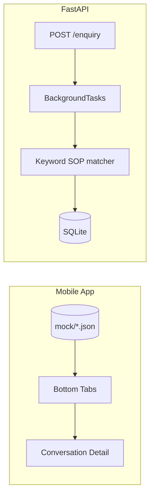

# SignalDesk

Production-style monorepo for an enquiry-handling workflow API and a React Native operations dashboard. Built for a dual-track internship assignment: **backend** and **frontend** in one repository, clearly separated.

```
SignalDesk/
├── backend/          # FastAPI enquiry workflow API
├── frontend/         # Expo React Native mobile dashboard (mock data)
├── docs/             # Screenshots + walkthrough video (you add media)
└── README.md         # This file
```

## What this is

**SignalDesk** is an internal-style tool for a small business owner to triage inbound customer enquiries. The backend accepts messages, matches them against hardcoded SOP playbooks via keyword logic (no AI), and records an operational timeline. The mobile app surfaces leads, escalations, and follow-ups using realistic mock JSON — no API wiring required for the UI track.

## Quick start

### Backend

```bash
cd backend
python -m venv .venv
.venv\Scripts\activate          # Windows
# source .venv/bin/activate     # macOS/Linux
pip install -r requirements.txt
uvicorn app.main:app --reload --port 8000
```

- API: http://127.0.0.1:8000  
- Docs: http://127.0.0.1:8000/docs  
- Tests: `pytest -q`  
- Manual calls: `backend/signaldesk.http`

### Frontend

```bash
cd frontend
npm install
npx expo start
```

## Assignment checklist

### Backend

| Requirement | Location |
|-------------|----------|
| `POST /enquiry` | `backend/app/routers/enquiry.py` |
| `POST /enquiry/{id}/follow-up` | same |
| `POST /enquiry/{id}/escalate` | same |
| `GET /enquiry/{id}/history` | same |
| `GET /health` | `backend/app/routers/health.py` |
| Async background SOP matching | `BackgroundTasks` → `process_enquiry_background` |
| 5 hardcoded SOPs | `backend/app/sops.py` |
| SQLite + rationale | [backend/README.md](backend/README.md) |
| JSON structured logging | `backend/app/logging_config.py` |
| OpenAPI descriptions | Pydantic `Field` examples on schemas |
| API tests | `backend/tests/` |
| Celery vs BackgroundTasks | [backend/README.md](backend/README.md) |

### Frontend

| Requirement | Location |
|-------------|----------|
| Bottom tabs: Home, Leads, Escalations, Follow-ups | `frontend/src/navigation/MainTabs.tsx` |
| Conversation Detail (stack) | `frontend/src/navigation/RootNavigator.tsx` |
| Mock JSON in `/mock` | `frontend/mock/` |
| Reusable components | `frontend/src/components/` |
| StyleSheet rationale | [frontend/README.md](frontend/README.md) |

## Architecture (high level)



The mobile app is intentionally decoupled from the API for this submission; data shapes mirror what a future integration would consume.

## Walkthrough video (2–5 minutes)

Record **one** video covering both tracks and place it at:

`docs/walkthrough.mp4` (or link from `docs/walkthrough.md`)

Suggested outline:

1. **Backend (60–90s)** — health check, create enquiry, show `/docs`, poll history for SOP match vs auto-escalation, follow-up and manual escalate.
2. **Frontend (60–90s)** — tab through Home → Leads → Escalations → Follow-ups, open Conversation Detail, point at mock JSON folder.
3. **Close (30s)** — SQLite + BackgroundTasks choices, known limitations.

See [docs/walkthrough.md](docs/walkthrough.md) for a script template.

## Screenshots

Capture all five screens into `docs/screenshots/` (see [docs/screenshots/README.md](docs/screenshots/README.md)).

## Design choices (summary)

| Topic | Decision | Why |
|-------|----------|-----|
| Database | SQLite | Zero-infra for reviewers; PostgreSQL-ready SQLAlchemy models |
| Background work | FastAPI `BackgroundTasks` | No Redis/Celery ops for a fast keyword task |
| Mobile styling | `StyleSheet` + theme tokens | Simple, native, easy to review |
| Scope | No auth, AI, or payments | Assignment boundary |

## License

MIT — internship submission, free and open-source stack only.
