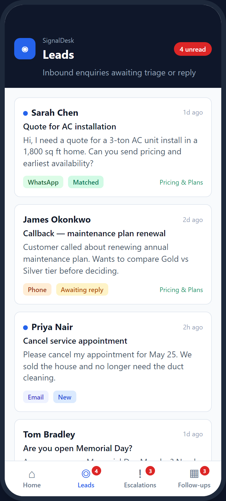

# Leads inbox

Inbound threads waiting on triage or reply. Card: name, subject, preview, channel badge, status, matched SOP when present. Unread = blue dot; header badge = unread count. Source: `frontend/mock/enquiries.json` via `mockData.ts`.
